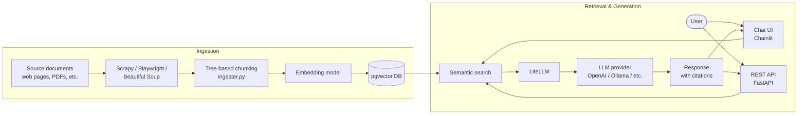

# Nava Labs Assistive Chatbot

Welcome! This is an open-source template from [Nava Labs](https://github.com/navapbc) for building an AI-powered assistive chatbot. It provides a production-ready starting point for a generative AI chatbot that uses retrieval-augmented generation (RAG) to answer questions grounded in your own documentation.

Use this template to stand up a chatbot that ingests domain-specific content (policy documents, knowledge-base articles, internal documentation, etc.), indexes it for semantic search, and serves answers through a chat UI and a REST API.

## Table of contents

- [How it works](#how-it-works)
- [Project components](#project-components)
- [Set up and run the application](#set-up-and-run-the-application)
  - [Managing the chatbot's data](#managing-the-chatbots-data)
- [Research and evaluation](#research-and-evaluation)
- [Deploying the application](#deploying-the-application)
- [Contributing](#contributing)

## How it works

The chatbot follows a standard RAG pipeline: source content is ingested and indexed into a vector database, then user questions are answered by retrieving relevant chunks and passing them to an LLM as context.

## Project components

This template is built on Nava's open-source [infrastructure template](https://github.com/navapbc/template-infra) and [Python application template](https://github.com/navapbc/template-application-flask/), part of [Nava's Platform](https://github.com/navapbc/platform).

- The application is hosted in AWS, with infrastructure defined via Terraform in [/infra](./infra).
- The application code is written in Python and lives in [/app/src](./app/src).
  - Chainlit and FastAPI provide the chat UI and a REST API for third-party integrations.
  - LiteLLM provides a vendor-agnostic interface for accessing LLMs.
- The application uses AWS Aurora Serverless v2 in deployed environments and Postgres locally. SQLAlchemy is used as the ORM, with Alembic and Pydantic managing the schema. Model definitions live in [app/src/db/models](./app/src/db/models).
  - The `pgvector` extension provides a `vector` type used for semantic search and document retrieval.
- Source documentation is scraped, parsed, and indexed via [ingest_runner.py](./app/src/ingest_runner.py), which uses Scrapy, Playwright, and Beautiful Soup. A custom "tree-based chunking" pipeline in [ingester.py](./app/src/ingester.py) splits content into semantically-meaningful chunks.
- Evaluation code for measuring retrieval-pipeline performance is in [/app/notebooks/metrics](./app/notebooks/metrics).
- Additional exploratory code and notebooks live in [/app/notebooks](./app/notebooks).

## Set up and run the application

To set up your local development environment, follow the instructions in [Getting Started](docs/app/getting-started.md).

### Managing the chatbot's data

To learn more about how to configure data ingestion and refresh the indexed content, see [Data Management](docs/data-management.md).

## Research and evaluation

The chatbot includes built-in commands for research and evaluation, including batch processing and exporting user interaction logs. See [Special Commands](docs/special-commands.md).

You can also run [promptfoo](https://www.promptfoo.dev/) evaluations against multiple test inputs using Google Sheets. See [Promptfoo Evaluations](docs/app/evaluation/promptfoo-google-sheets.md).

## Deploying the application

See [Deployments and Releases](docs/releases.md) for information about deploying to your environments.

## Contributing

Contributions are welcome! See [CONTRIBUTING.md](CONTRIBUTING.md) and our [Code of Conduct](CODE_OF_CONDUCT.md) for details.
