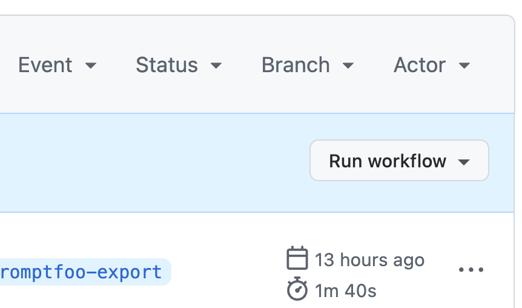
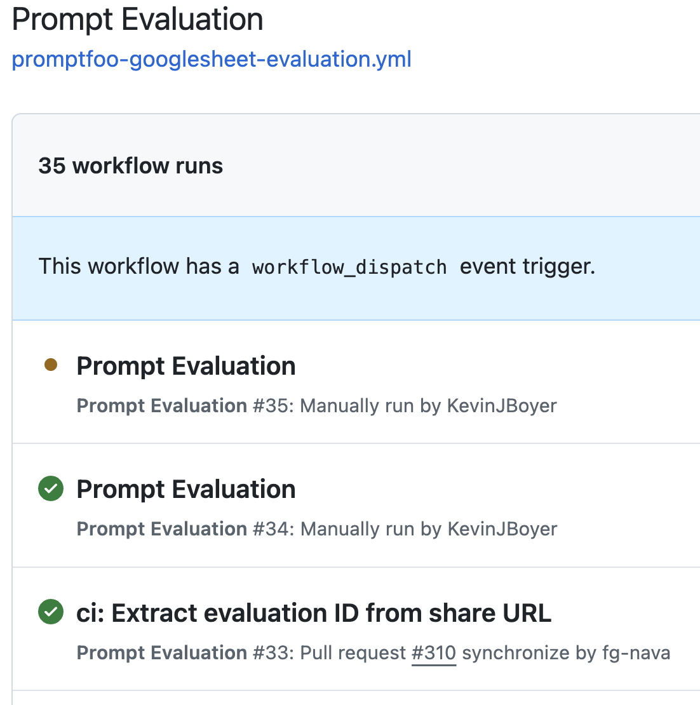

# Promptfoo evaluations via Google Sheets

[Promptfoo](https://promptfoo.dev/) is an evaluation framework for LLM outputs. This template integrates Promptfoo with Google Sheets so that test cases and results can be authored, run, and shared from a familiar interface.

You can run evaluations two ways:

- **Locally via the Promptfoo CLI** — fast iteration against a local instance of the chatbot.
- **Via a GitHub Actions workflow** — one-click runs against a deployed instance, with results written back to the sheet.

## Test case sheet format

Create a Google Sheet with at least these three columns:

| Column        | Description                                | Example                                       |
| ------------- | ------------------------------------------ | --------------------------------------------- |
| `capability`  | What you'd like to test                    | `It refuses to answer out-of-scope questions` |
| `question`    | The input sent to the chatbot              | `What is X?`                                  |
| `__expected`  | Assertion applied to the chatbot's output  | `contains:Sorry, I can't answer that.`        |

Promptfoo supports [many assertion types](https://www.promptfoo.dev/docs/configuration/expected-outputs/#assertion-types) beyond `contains:`. See also the [Google Sheets format reference](https://www.promptfoo.dev/docs/configuration/parameters/#import-from-csv).

## Option A: Run locally via the Promptfoo CLI

### 1. Install promptfoo

```bash
npm install -g promptfoo
npm install googleapis   # peer dependency for Google Sheets integration
promptfoo init           # creates a placeholder promptfooconfig.yaml
```

### 2. Make your test sheet readable

For local CLI runs, the simplest path is to make the sheet public:

- Share → Anyone with the link → **Viewer**

Alternatively, use service-account authentication (see [Writing results back to Google Sheets](#writing-results-back-to-google-sheets)).

### 3. Configure promptfoo

Use the [promptfooconfig-template.yaml](promptfooconfig-template.yaml) in this directory as a starting point. It's preconfigured to hit the chatbot's `/api/query` endpoint with the following request fields:

- `chat_history` — empty array for new sessions
- `session_id` — a unique identifier (generated via a JavaScript helper)
- `new_session` — whether to create a new session
- `message` — the question from the test case
- `user_id` — the user ID

`transformResponse: "json ? json.response_text : ''"` extracts the `response_text` field from the API response.

#### Unique session IDs

Promptfoo doesn't have built-in `{{$uuid}}` / `{{$random}}` variables, so generate unique IDs via a small JavaScript helper. See [generateUniqueId.js](generateUniqueId.js) and reference it from `defaultTest.vars` in the config.

Key Nunjucks templating tips:

- Variables from test cases are accessed as `{{variableName}}`.
- For dynamic values, use a JS file referenced as `file://path/to/script.js`.
- Place shared variables under `defaultTest.vars` to make them available to all tests.
- JS functions must return an object with an `output` property.

### 4. Start the chatbot

```bash
make start
```

This runs the service on `http://localhost:8000`.

### 5. Run the evaluation

```bash
# Run
promptfoo eval -c promptfooconfig.yaml

# View results in a web UI (separate terminal)
promptfoo view
```

### Writing results back to Google Sheets

To write results back to a sheet, set up Google service-account credentials:

1. In [Google Cloud Console](https://console.cloud.google.com/), create a project (or reuse one) and enable the **Google Sheets API**.
2. Create a service account under **Credentials → Create Credentials → Service Account** and download the JSON key file.
3. Set:

   ```bash
   export GOOGLE_APPLICATION_CREDENTIALS="/path/to/your/service-account-file.json"
   ```

4. In the JSON key, find `client_email` and share your Google Sheet with that address as **Editor**.

Then add an `outputPath` to your config (or pass `-o` on the CLI):

```yaml
# Input sheet for test cases
tests: https://docs.google.com/spreadsheets/d/{sheetId}/edit?gid={gid}

# Option 1: overwrite an existing tab (include gid)
# outputPath: https://docs.google.com/spreadsheets/d/{sheetId}/edit?gid={gid}

# Option 2: append a new tab per evaluation (omit gid)
# outputPath: https://docs.google.com/spreadsheets/d/{sheetId}/edit
```

Or via CLI:

```bash
promptfoo eval -c promptfooconfig.yaml -o https://docs.google.com/spreadsheets/d/{sheetId}/edit
```

To export a previously-run evaluation:

```bash
promptfoo export latest --output https://docs.google.com/spreadsheets/d/{sheetId}/edit
```

The evaluation ID is printed after each run (`Evaluation complete. ID: ...`). `latest` works as a shortcut.

## Option B: Run via the GitHub Actions workflow

The template includes a `promptfoo-googlesheet-evaluation.yml` GitHub Actions workflow that runs evaluations against a deployed instance of the chatbot and writes results back to the sheet — no local setup required.

### One-time setup

1. Create a Google Cloud service account and download the JSON key (as above).
2. Add the JSON key as a GitHub Actions secret that the workflow can read (see the workflow file for the expected secret name).
3. Note the service account's email address. You'll share every test sheet with this address.

### Running an evaluation

1. Create a sheet with the columns described in [Test case sheet format](#test-case-sheet-format).
2. Share **Editor** access to the sheet with your service account email.
3. Copy the sheet URL, e.g. `https://docs.google.com/spreadsheets/d/{sheetId}/edit?gid=0#gid=0`.
4. Go to the **Prompt Evaluation** GitHub Actions workflow for your repo and click **Run workflow**:

   

5. Paste the sheet URL into both `Google Sheet URL for test case inputs` and `Google Sheet URL for evaluation outputs`.
   - If there's a non-zero `gid` at the end of the output URL, **that tab will be overwritten**. To write a new tab instead, strip the `gid`: `https://docs.google.com/spreadsheets/d/{sheetId}/edit`.
   - Leave `Use workflow from` and `Chatbot API endpoint URL` at defaults (see below).
6. Click **Run workflow**. Refresh the page; you should see your run with a yellow running indicator:

   

7. After roughly 3–5 minutes the run finishes (green check). Results will appear in the sheet.

### Advanced options

- **`Use workflow from`** — selects the branch GitHub checks out to run the workflow YAML. Leave at `main` unless you're iterating on the workflow itself. This does **not** change the chatbot prompt or code being evaluated.
- **`Chatbot API endpoint URL`** — which deployed instance to evaluate. Defaults to the dev environment. You can point it at a preview environment, e.g. `http://<preview-host>/api/query` (without SSL if the certificate doesn't match the domain).

## Troubleshooting

- **404 Not Found**: ensure the chatbot is running (`make start` locally, or that the deployed endpoint is reachable).
- **Auth errors**: if the chatbot API requires authentication, add the appropriate headers in your config.
- **Session already exists**: ensure your `uniqueSessionId` function returns truly unique IDs.
- **Google Sheets access errors**: confirm the service account has Editor access to the sheet and that the Sheets API is enabled on the Cloud project.

## Resources

- [Promptfoo docs](https://promptfoo.dev/docs/intro)
- [Promptfoo Google Sheets integration](https://promptfoo.dev/docs/configuration/load-from-googlesheets)
- [Assertion types](https://www.promptfoo.dev/docs/configuration/expected-outputs/#assertion-types)
